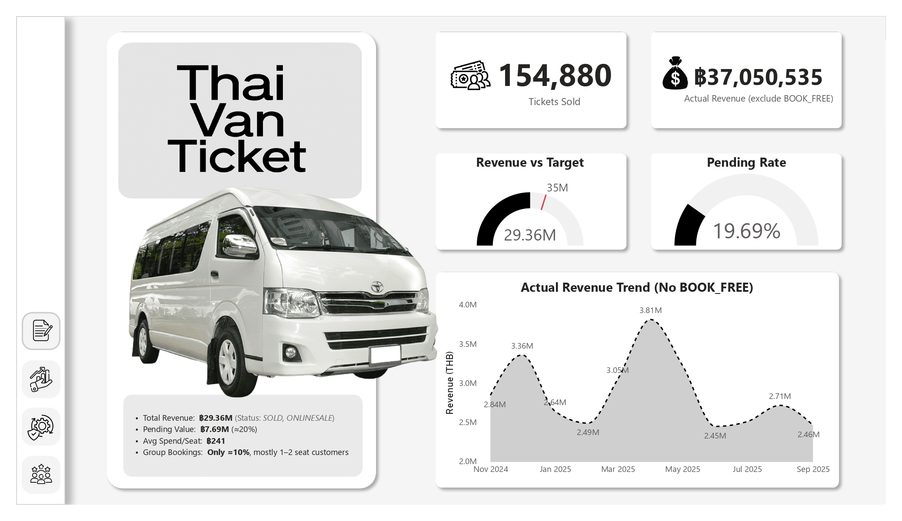
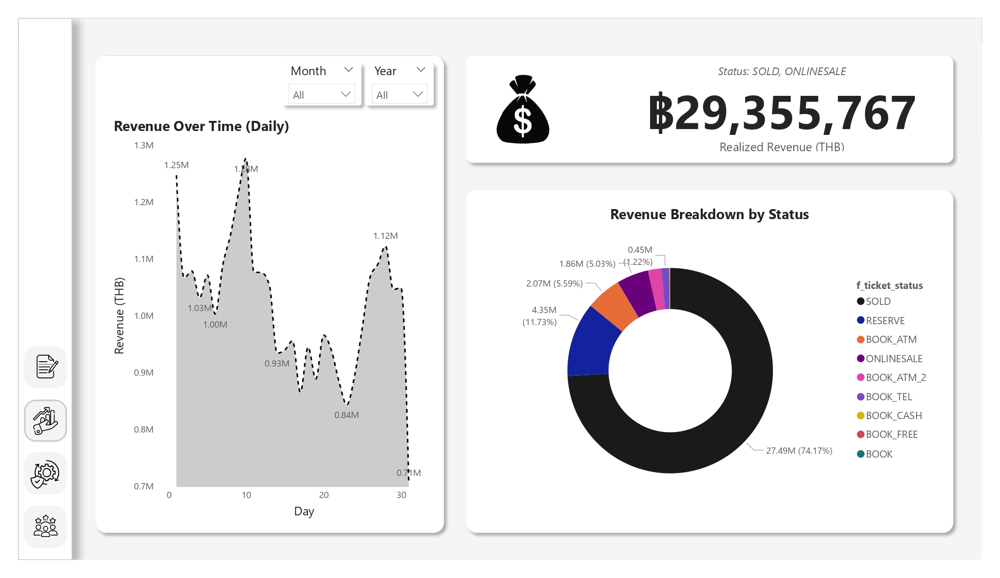
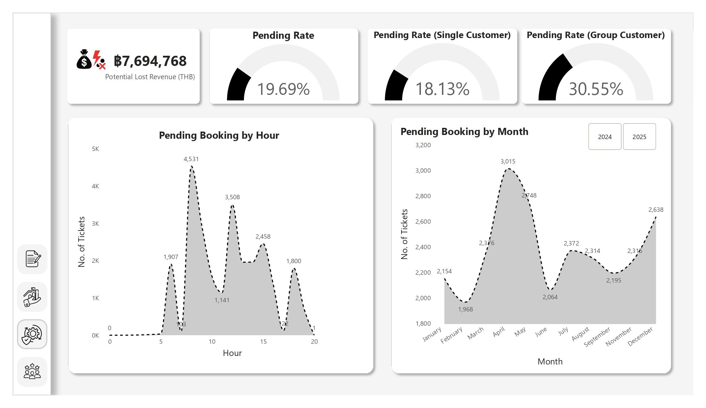
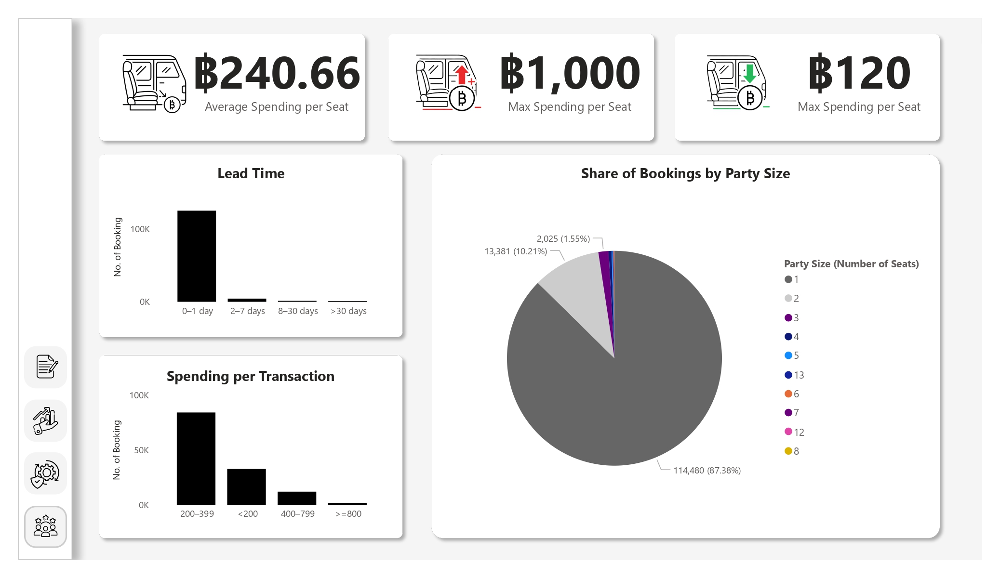

# 🚐 Thai Van Ticket Data Analysis & Dashboard

[English Version Below](#english-version)

---

<a name="thai-version"></a>
## 🇹🇭 เวอร์ชั่นภาษาไทย!

### ภาพรวมโปรเจกต์
โปรเจกต์นี้เป็นการวิเคราะห์ข้อมูลการจองตั๋วรถตู้ (Thai Van Ticket) จากกิจกรรม Mini Hackathon เพื่อค้นหาข้อมูลเชิงลึกทางธุรกิจ (Business Insights) และนำเสนอผ่าน **Interactive Dashboard** ด้วย Power BI วัตถุประสงค์คือเพื่อให้ผู้บริหารสามารถติดตามภาพรวมธุรกิจ วิเคราะห์ยอดขาย ค้นหาจุดรั่วไหลของรายได้ และเข้าใจพฤติกรรมลูกค้าได้ดียิ่งขึ้น เป็นการแข่งขันภายในมหาวิทยาลัยกรุงเทพ
* **ระยะเวลาดำเนินการโปรเจกต์:** 1 พฤศจิกายน 2568 - 9 พฤศจิกายน 2568
* [**รายละเอียดและข้อมูลเพิ่มเติมเกี่ยวกับโปรเจกต์**](https://www.canva.com/design/DAG3WLG0FnY/i0SQTbZA6AOtN2kT_vD8uw/edit?utm_content=DAG3WLG0FnY&utm_campaign=designshare&utm_medium=link2&utm_source=sharebutton)

### เครื่องมือที่ใช้
* **Python (Jupyter Notebook):** สำหรับการเตรียมข้อมูล (Data Cleaning) และวิเคราะห์เบื้องต้น
* **SQL:** สำหรับการดึงข้อมูล (Query) และสร้างตารางสรุปผล
* **Power BI:** สำหรับการสร้าง Dashboard และ Data Visualization

### โครงสร้างไฟล์
```text
.
├── 📊 dashboard/
│   └── Mini Hackathon Thai Van Ticket.pbix
├── 💾 data/
│   └── aie222_db_thaivanticket_hackathon_2025.csv
├── 🖼️ image/
│   ├── 1_summary.jpg
│   ├── 2_sales.jpg
│   ├── 3_operational.jpg
│   └── 4_customer.jpg
├── 📓 notebooks/
│   └── Mini Hackathon Thai Van Ticket.ipynb
└── 📝 README.md
```

### ขั้นตอนการทำงาน ✨
1. **การทำความเข้าใจข้อมูลและกำหนด KPI (Data Understanding)**
   - รับ Dataset และทำการเชื่อมต่อ Server ตามที่อาจารย์กำหนดผ่าน Colab และ Power BI
   - สำรวจข้อมูลดิบเพื่อทำความเข้าใจ Business Logic โดยเฉพาะการจำแนกสถานะตั๋วทั้ง 9 ประเภท
   - จัดกลุ่มสถานะตั๋วเป็นกลุ่ม "รายได้จริง" (`SOLD`, `ONLINESALE`) และกลุ่ม "จุดรั่วไหล" (`BOOK_ATM_2`, `BOOK_CASH`, `BOOK_ATM`, `BOOK_TEL`, `BOOK`, `RESERVE`) เพื่อกำหนดตัวชี้วัด (KPIs) ที่สำคัญทางธุรกิจ

2. **การเตรียมข้อมูลและทดสอบตรรกะ (Data Prep & Logic Testing)**
   - ใช้ **Python (Pandas)** ในการตรวจสอบคุณภาพข้อมูลเบื้องต้น (Data Profiling)
   - เขียน **SQL Queries** เพื่อทดสอบตรรกะการคำนวณของ KPI ซับซ้อน เช่น *มูลค่ารายได้ที่อาจสูญเสีย (Potential Lost Revenue)* และ *อัตราการจองทิ้งรายชั่วโมง* ก่อนนำไปสร้างจริงใน BI Tool

3. **การออกแบบโมเดลข้อมูล (Data Modeling)**
   - ออกแบบ Data Model รูปแบบ **Star Schema** ใน Power BI เพื่อประสิทธิภาพในการประมวลผล
   - สร้างตารางมิติเวลา **(Master Date Dimension)** ด้วย DAX เพื่อให้สามารถวิเคราะห์ข้อมูลตามช่วงเวลา (Time-intelligence) และกรองข้อมูลข้ามตารางได้อย่างถูกต้องแม่นยำ (รองรับข้อมูลปี 2024-2025)

4. **การพัฒนาแดชบอร์ด (Dashboard Development)**
   - สร้างสูตร **DAX Measures** ซับซ้อน (เช่น `CALCULATE`, `SUMX`) เพื่อคำนวณ KPI แบบไดนามิกที่เปลี่ยนค่าตามการกรองของผู้ใช้
   - ออกแบบหน้ารายงาน Interactive 4 หน้า โดยเน้นการเล่าเรื่องด้วยข้อมูล (Data Storytelling) ตั้งแต่ภาพรวมระดับผู้บริหารไปจนถึงรายละเอียดระดับปฏิบัติการ

---

### ตัวอย่าง Dashboard

#### 1. Executive Summary (ภาพรวมผู้บริหาร)
หน้ารวม KPI สำคัญ เช่น รายได้จริง, จำนวนตั๋วที่ขายได้ และอัตราการจองล้มเหลว เพื่อให้เห็นสถานภาพของธุรกิจได้อย่างรวดเร็ว


#### 2. Sales & Revenue Deep Dive (เจาะลึกยอดขาย)
วิเคราะห์เจาะลึกว่ารายได้มาจากสถานะไหน และช่วงเวลาใดขายดีที่สุด


#### 3. Operational Health & Leaks (จุดรั่วไหลของรายได้)
ติดตามยอดการจองที่ยังไม่ชำระเงิน (Pending) หรือล้มเหลว เพื่อหาแนวทางแก้ไขและเพิ่มรายได้


#### 4. Customer Behavior (พฤติกรรมลูกค้า)
วิเคราะห์พฤติกรรมผู้ซื้อ เช่น ระยะเวลาการจองล่วงหน้า และจำนวนที่นั่งต่อการจอง


<br>

---

<a name="english-version"></a>
## 🇬🇧 English Version

### Project Overview
This project analyzes van ticket booking data (Thai Van Ticket) from a Mini Hackathon event. The goal is to uncover business insights and present them through an **Interactive Dashboard** using Power BI, enabling executives to track business performance, analyze sales, identify revenue leaks, and understand customer behavior.
* **Project Duration:** November 1, 2025 - November 9, 2025
* [**Project Details and Additional Information**](https://www.canva.com/design/DAG3WLG0FnY/i0SQTbZA6AOtN2kT_vD8uw/edit?utm_content=DAG3WLG0FnY&utm_campaign=designshare&utm_medium=link2&utm_source=sharebutton)

### Tools Used
* **Python (Jupyter Notebook):** For data preparation (cleaning) and initial analysis.
* **SQL:** For data querying and creating aggregated tables.
* **Power BI:** For Dashboard creation and Data Visualization.

### File Structure
```text
.
├── 📊 dashboard/
│   └── Mini Hackathon Thai Van Ticket.pbix
├── 💾 data/
│   └── aie222_db_thaivanticket_hackathon_2025.csv
├── 🖼️ image/
│   ├── 1_summary.jpg
│   ├── 2_sales.jpg
│   ├── 3_operational.jpg
│   └── 4_customer.jpg
├── 📓 notebooks/
│   └── Mini Hackathon Thai Van Ticket.ipynb
└── 📝 README.md
```

### Methodology / Workflow

1. **Data Understanding & KPI Definition**
   - Received the dataset and established server connections via Colab and Power BI as provided by the instructor.
   - Explored raw data to understand business logic, specifically classifying the 9 ticket statuses into "Confirmed Revenue" (`SOLD`, `ONLINESALE`) and "Operational Leaks" (`BOOK_ATM_2`, `BOOK_CASH`, `BOOK_ATM`, `BOOK_TEL`, `BOOK`, `RESERVE`) to define key business KPIs.

2. **Data Preparation & Logic Testing (SQL/Python)**
   - Utilized **Python (Pandas)** for initial data profiling and quality checks.
   - Wrote complex **SQL queries** to prototype and validate logic for metrics like *Potential Lost Revenue* and *Hourly Abandonment Rate* before BI implementation.

3. **Data Modeling (Power BI)**
   - Designed a **Star Schema** data model in Power BI for optimized query performance.
   - Created a dedicated **Master Date Dimension** table using DAX to enable accurate time-intelligence analysis and unified cross-filtering across all report pages (supporting 2024-2025 data).

4. **Dashboard Development & Visualization**
   - Developed complex **DAX measures** (e.g., `CALCULATE`, `SUMX`) for dynamic KPI tracking that responds to user interactions.
   - Designed a 4-page interactive layout focusing on data storytelling, guiding users from a high-level executive overview down to granular operational details.

---

### Dashboard Showcase

#### 1. Executive Summary
A high-level view of key KPIs such as Confirmed Revenue, Tickets Sold, and Failure Rate for quick business health assessment.


#### 2. Sales & Revenue Deep Dive
In-depth analysis of revenue status, identifying top-selling products and peak sales periods.


#### 3. Operational Health & Leaks
Tracks pending or failed bookings to identify operational issues and potential revenue recovery opportunities.


#### 4. Customer Behavior
Analyzes customer booking patterns, including booking lead time and party size preferences.

<a name="english-version"></a>
